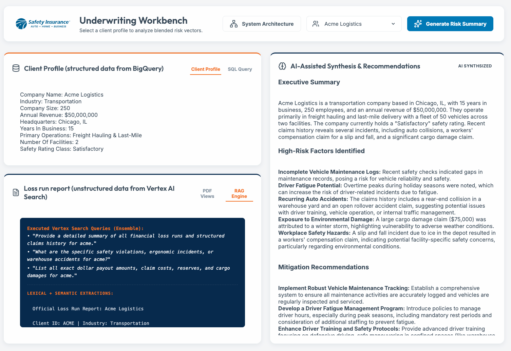
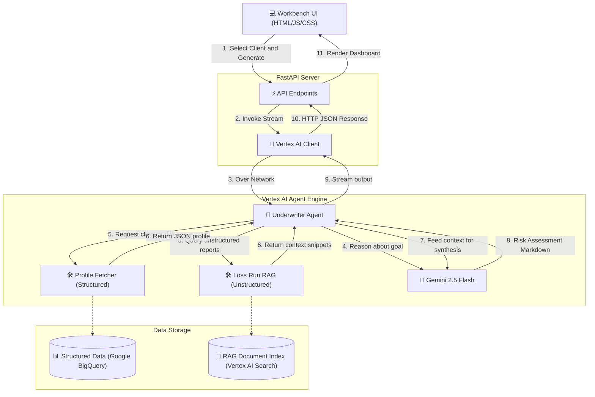

# AI-Assisted Underwriter Demo

This AI-Assisted Underwriting demo integrates **Gemini** and the **Google Agent Development Kit (ADK)** to automate the synthesis of structured client data (live Google BigQuery data) and unstructured loss run reports (native PDF documents). 

By selecting a client profile in the web dashboard and clicking "Generate Risk Summary", underwriters receive an instant, agent-driven analysis that identifies high-risk patterns, correlates risk factors, and provides automated mitigation recommendations directly.



## Business Value

- **Operational Velocity:** Accelerates the quote-to-bind lifecycle by replacing manual document review with automated LLM summarization.
- **Data-Driven Underwriting:** Improves loss ratios by surfacing granular risk insights from fragmented sources that human reviewers might overlook.
- **Workflow Optimization:** Reduces cognitive load for underwriters, allowing them to focus on complex risk engineering rather than administrative data entry.

## Architecture & Technology Stack

Below is the architecture diagram illustrating how the web dashboard, FastAPI server, Google ADK orchestration, and live Google Cloud data pipelines interact to generate the risk assessment.



- **Backend / Orchestration:**
  - **FastAPI:** High-performance Python server serving the frontend and acting as a stateless proxy.
  - **Google ADK (Agent Development Kit):** Used to author and deploy the `underwriter_agent` as a standalone unit to **Vertex AI Agent Engine**.
  - **Vertex AI Client:** The FastAPI backend securely invokes the deployed reasoning engine via the `google.genai` SDK.
  - **Gemini 2.5 Flash:** Core LLM configured within the ADK for high-accuracy synthesis.
- **Frontend / UI:**
  - Single-Page Application using Vanilla HTML5, CSS3, and JavaScript.
  - Professional corporate light-mode theme (Safety Insurance branding) featuring interactive diagnostic data panes and native Mermaid architecture overlays.

## Advanced Features

- **Real-Time SSE Streaming:** The generation pipeline implements Server-Sent Events (SSE) over the FastAPI bridge to map Google ADK lifecycle states natively. This evaluates byte-chunks dynamically, rendering a ChatGPT-like "Typewriter" cadence across the UI rather than invoking massive blocking network callbacks, entirely eradicating perceived user latency.
- **Enterprise Vertex AI (Extractive Segments):** The backend actively overrides standard keyword extractions prioritizing Google Cloud's Enterprise tier to utilize the `ExtractiveContentSpec`. Instead of restricted keyword excerpts truncated with jarring `...` artifacts, the RAG tool natively extracts massive, pure document paragraphs spanning the semantic boundary. 
> **Important:** To utilize Extractive Segments, ensure your Search App has "Enterprise Edition" securely enabled within the GCP Agent Builder console.

## Prerequisites

- Python >= 3.13
- [`uv`](https://docs.astral.sh/uv/) (Python package manager, standard across the workspace).
- A valid Google API Key with Gemini API access enabled.

## Running the Application Locally

The project is structured into `frontend/` and `backend/` directories, but runs from the workspace root for simplicity.

1. **Install Dependencies:**
   The project uses `uv` for dependency management. 
   ```bash
   uv sync
   ```

2. **Authenticate Google Cloud & Gemini:**
   Ensure you have Application Default Credentials (ADC) configured in your environment to authenticate with BigQuery, and export your Gemini API key.
   ```bash
   gcloud auth application-default login
   export GOOGLE_API_KEY="your_api_key_here"
   ```

3. **Seed the Cloud Databases:**
   Run the setup scripts to provision and populate the `underwriter_demo.client_profiles` table in BigQuery, and build the native PDF index in Vertex AI Search (RAG).
   ```bash
   uv run python scripts/setup_bq.py
   uv run python scripts/setup_rag.py
   ```
   *(Note: Vertex AI Search indexing for newly created data stores can take up to 15-30 minutes to complete in the background).*

4. **Start the FastAPI Server:**
   Run the `uvicorn` server to serve the backend endpoints and mount the root frontend UI.
   ```bash
   uv run uvicorn backend.main:app --port 8000 --host 0.0.0.0
   ```
   *(Optional: pass the `--reload` flag during active development).*

5. **Access the Dashboard:**
   Open your browser and navigate to:
   [http://localhost:8000/](http://localhost:8000/)

## Deploying the Agent to Vertex AI Agent Engine

The core intelligence logic is decoupled and deployed directly into Vertex AI Agent Engine using the standalone deployment script:
```bash
./deploy_agent.sh
```
Once deployed, export the generated `AGENT_ID` resource name in your terminal so your backend routes traffic securely to the managed instance instead of defaulting locally.

## Deploying Backend to Google Cloud Run

To containerize and launch the FastAPI Underwriter Workbench backend globally, execute the automated deployment script:
```bash
./deploy.sh
```

**Secure Access (Zero-Trust):**
By design, the deployment disables unauthenticated public access. Browsing directly to the live `.run.app` URL will result in a `403 Forbidden` error unless you authenticate. 
To securely tunnel your local Google Cloud credentials into the live production service for developer testing, open a new terminal tab and spin up the natively authenticated proxy:

```bash
gcloud run services proxy underwriter-workbench --region us-central1 --port 8080
```
You can now securely access the production app via `http://localhost:8080`.

## Project Structure

```text
UnderwriterDemo/
├── pyproject.toml              # Project dependencies and configurations
├── underwriter_agent/          # Core Google ADK agent orchestration logic (Standalone Package)
│   ├── agent.py                # Agent instructions and tooling definitions
│   └── tools.py                # External Google Cloud data retrieval tools
├── backend/
│   └── main.py                 # FastAPI backend routing and Vertex AI reasoning engine integration
├── scripts/                    # Initialization and diagnostic tools
│   ├── setup_bq.py             # Provisions structured client profile datasets in BigQuery
│   ├── setup_rag.py            # Uploads PDFs with exact metadata to Vertex AI Search
│   └── test_rag.py             # CLI validation script natively evaluating backend tools logic
└── frontend/                   # Vanilla frontend assets wrapped and mounted at root
    ├── index.html
    ├── index.css
    └── index.js
```

## Diagnostics & Testing

The project includes a standalone script to manually execute Data Store searches against the Cloud pipeline without spinning up the Uvicorn Agent server. This is useful to verify the native metadata filtering (`client_id`) and inspect the exact JSON snippets passed to the Underwriter AI.

```bash
uv run python scripts/test_rag.py --client stella
```
