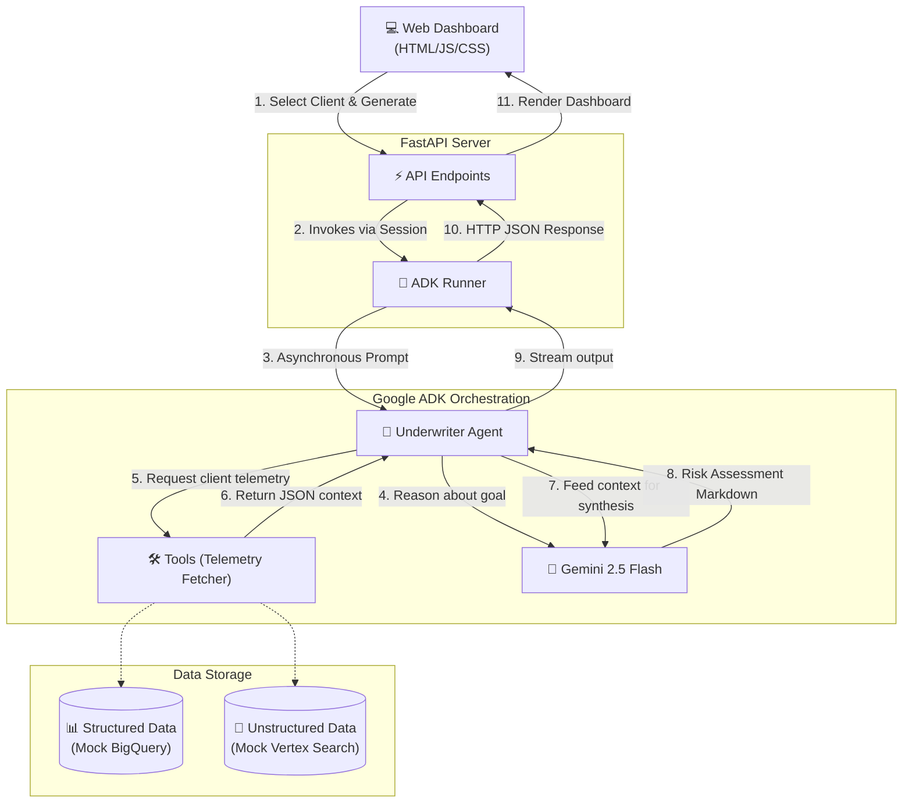

# AI-Assisted Underwriter Demo

This AI-Assisted Underwriting demo integrates **Gemini** and the **Google Agent Development Kit (ADK)** to automate the synthesis of structured telemetry (simulated BigQuery data) and unstructured loss run reports (simulated Vertex AI Search). 

By selecting a client profile in the web dashboard and clicking "Generate Risk Summary", underwriters receive an instant, agent-driven analysis that identifies high-risk patterns, correlates risk factors, and provides automated mitigation recommendations directly.

## Business Value

- **Operational Velocity:** Accelerates the quote-to-bind lifecycle by replacing manual document review with automated LLM summarization.
- **Data-Driven Underwriting:** Improves loss ratios by surfacing granular risk insights from fragmented sources that human reviewers might overlook.
- **Workflow Optimization:** Reduces cognitive load for underwriters, allowing them to focus on complex risk engineering rather than administrative data entry.

## Architecture & Technology Stack

Below is the architecture diagram illustrating how the web dashboard, FastAPI server, Google ADK orchestration, and simulated data sources interact to generate the risk assessment.



- **Backend / Orchestration:**
  - **FastAPI:** High-performance Python server managing endpoints.
  - **Google ADK (Agent Development Kit):** Orchestrates Gemini interactions, tool-calling (to fetch simulated database records), and asynchronous context streaming via the `Runner`.
  - **Gemini 2.5 Flash:** Core LLM configured within the ADK for high-accuracy synthesis.
- **Frontend / UI:**
  - Single-Page Application using Vanilla HTML5, CSS3, and JavaScript.
  - Premium "Cyber-Dark" theme featuring glassmorphism and modern micro-animations.

## Prerequisites

- Python >= 3.13
- [`uv`](https://docs.astral.sh/uv/) (Python package manager, standard across the workspace).
- A valid Google API Key with Gemini API access enabled.

## Running the Application Locally

The project is structured into `frontend/` and `backend/` directories, but runs from the workspace root for simplicity.

1. **Install Dependencies:**
   The project uses `uv` for dependency management. 
   ```bash
   uv sync
   ```

2. **Set Environment Variables:**
   Export your Google API key to allow the ADK agent to perform synthesis.
   ```bash
   export GOOGLE_API_KEY="your_api_key_here"
   ```

3. **Start the FastAPI Server:**
   Run the `uvicorn` server to serve the backend endpoints and mount the root frontend UI.
   ```bash
   uv run uvicorn backend.main:app --port 8000 --host 0.0.0.0
   ```
   *(Optional: pass the `--reload` flag during active development).*

4. **Access the Dashboard:**
   Open your browser and navigate to:
   [http://localhost:8000/](http://localhost:8000/)

## Project Structure

```text
UnderwriterDemo/
├── pyproject.toml              # Project dependencies and configurations
├── backend/
│   ├── main.py                 # FastAPI backend routing and ADK runner integration
│   └── underwriter_agent/
│       └── agent.py            # Google ADK agent definition, tools, and mock data
└── frontend/                   # Vanilla frontend assets wrapped and mounted at root
    ├── index.html
    ├── index.css
    └── index.js
```
